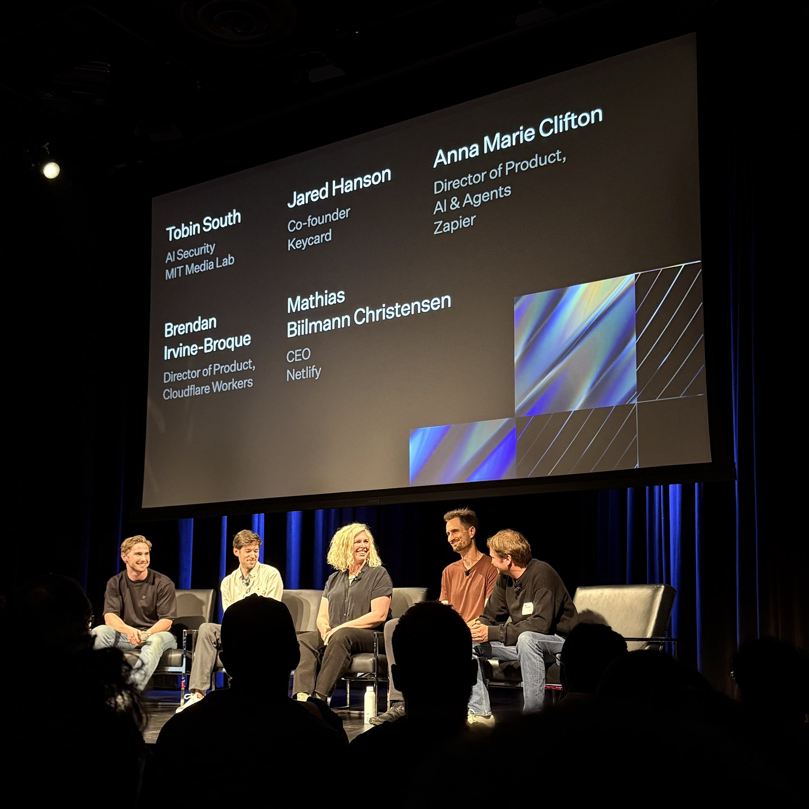

I've been thinking a lot about how we use AI in our daily work. Before my first [WorkOS](https://workos.com) onsite, I primarily used AI as a thinking assistant. I'd have higher-level architecture discussions with AI, use it to generate mermaid diagrams, and help manage the context in my head. Safe, controlled interactions.

That all changed during my AI week in San Francisco. Or did it?

## The Setup

At the onsite, I taught a workshop about using AI to augment your skills. The key message: AI should enhance what you do, not replace who you are. Break down problems into smaller pieces. Keep the AI focused on solutions, not praise. 

I also gave a lightning talk called "AI on the coding periphery" - showcasing all the ways AI helps with the boring stuff that eats your day. Not writing code, but everything around it.

Both went well. People nodded along. But I was still teaching from my comfort zone - AI as a helpful assistant, nothing more.

## The Problem

A large part of our onsite was dedicated to AI hacking - see what you can do with AI. Experiment and push boundaries. During this hacking session, I noticed a teammate had submitted a [pull request](https://github.com/workos/workos-node/pull/1273) to our Node SDK. Standard stuff. Then I spotted the same PR in our [Ruby](https://github.com/workos/workos-ruby/pull/365) and [PHP](https://github.com/workos/workos-php/pull/285) SDKs.

The tedium struck me immediately. Here's an incredible engineer doing the same simple task multiple times, context switching between languages. Time that could be spent on more interesting problems.

My teammate Nick and I claimed a corner of the conference room. We had a couple hours. Perfect time to experiment with something I'd yet to try: vibe coding.

## The Experiment

[Vibe coding](https://en.wikipedia.org/wiki/Vibe_coding) has a simple premise: you prompt an AI to write code, but you never look at the code itself. You test it, see what breaks, prompt again. Rinse and repeat.

It's like cooking with your eyes closed, tasting along the way and suggesting changes, but never dealing with ingredients directly.

**Our goal:** build a GitHub Action that would:
1. Watch for PRs with a specific label in any SDK repo
2. Analyze what changed
3. Automatically create matching PRs in our other SDK repos

**The constraint:** we wouldn't look at any code Claude wrote. Not once.

## The Journey

We started with [Claude Code](https://www.anthropic.com/claude-code) and a straightforward prompt explaining our requirements. Files started appearing. TypeScript. Lots of it.

First test with [`act`](https://github.com/nektos/act): complete failure. But not just any failure - the kind where entire files were being deleted and replaced with tiny fragments. **But it was doing something.** Code was changing, the action part was running as expected - **within minutes.**

This is where vibe coding gets challenging. When things go wrong, you're debugging blind. You can't just open the file and see what's happening. You have to think differently.

Instead of diving into code, I started interviewing Claude like a detective:
- "Walk me through your approach"
- "What exactly are you sending to the OpenAI API?"
- "Why would this approach result in deleted files?"

The revelation came after about an hour of this back-and-forth. Claude was sending entire file contents to OpenAI for every tiny change, blowing past context windows. The model was essentially panicking and returning fragments.

One corrective prompt changed everything: "Focus on diffs. Make minimal changes. Don't rewrite entire files for one-line modifications."

## The Results

By the end of our two-hour session:
- ~5,000 lines of TypeScript we never read
- A working [GitHub Action](https://github.com/workos/workos-node/tree/automatic-prs/.github/actions/sdk-sync) that successfully created PRs
- Automated SDK synchronization (with some rough edges)
- Zero lines of code written by human hands

The PRs it generated for [Ruby](https://github.com/workos/workos-ruby/pull/373) and [PHP](https://github.com/workos/workos-php/pull/284) weren't perfect. But they worked. Somewhat. Changes in one SDK triggered matching changes in others.

That night in my hotel room, I couldn't sleep. What had taken us two hours would have been days of careful coding before. If AI could do this now, what would it do in six months? A year? I'd spent fifteen years perfecting my craft, and suddenly I was wondering if those skills were becoming obsolete. The ground beneath my career felt unstable. Was I witnessing the beginning of the end for traditional programming? The thought was terrifying.

## MCP Night Perspective

The WorkOS team also organized a public [MCP Night](https://workos.com/mcp-night) at the Exploratorium. Here, everything shifted into focus. Over 600 developers wrapped around the building, waiting to get in. The energy inside was electric - not just excitement, but a collective recognition that something fundamental was changing.

The demos pushed boundaries I didn't know existed. An AI [ordering t-shirts](https://mcp.shop) through MCP. Postman showcasing automated API testing that felt alive. Block demonstrating Goose, their AI developer. Each demo peeling back another layer of what's possible when you give AI real tools to work with.

But the conversations between demos revealed something deeper. Experienced developers admitting they had no idea these capabilities existed. Others sharing wild experiments from their own labs. Everyone comparing notes, trying to map this new territory together.

Standing there, phone in hand, capturing the chaos for our social channels, I kept thinking about our afternoon experiment. We'd stumbled into something bigger than a GitHub Action. We'd glimpsed a different way of thinking about code itself.

## Lessons Learned

The vibe coding experiment forced me to confront assumptions I didn't know I had. When you can't see the code, you have to trust the process. When you can't debug traditionally, you develop new skills. When you can't micromanage every line, you learn what actually matters.

**The Good:** We went from idea to working prototype in two hours. Not perfect, not production-ready, but working. The speed of iteration was intoxicating. More importantly, debugging through conversation taught me to think about problems differently. Instead of diving into implementation details, I had to stay at the level of intent and approach.

**The Challenges:** Trust becomes everything when you can't verify. The code Claude generated worked, but lacked the elegance of human-crafted solutions. We discovered tool constraints only through failure. Each iteration revealed another assumption we'd made about how AI interprets our instructions.

**The Reality Check:** You can't vibe code your way to production systems. That's not the point. The point is recognizing when human eyes on every line of code isn't the highest value activity. Sometimes you need speed. Sometimes you need exploration. Sometimes you need to prototype five ideas in the time it would take to perfect one.

The practical sweet spot isn't full vibe coding or full manual coding. It's knowing when to apply each approach. Use AI for rapid prototyping. Let it handle boilerplate while you focus on architecture. Most importantly - and this is what I emphasized in my workshop - talk through problems with AI before interrupting busy teammates. Clear your own thinking first.

## The Transformation

Would I ship our vibe-coded GitHub Action to production? No way. Not without a thorough review and probably a rewrite. 

But that misses the point entirely.

Before that week, I taught people to use AI as a better rubber duck. After that week, I understood we're not just changing our tools - we're changing our relationship with code itself.

The developers still submitting the same PR three times aren't just wasting time. They're stuck in a paradigm where every line of code needs their direct touch. They're missing the chance to work at a higher level - to be orchestrators rather than typists.

My workshop talked about augmenting skills. My lightning talk showed AI handling peripheral tasks. But the vibe coding experiment? That showed me what augmentation really means. It's not about AI writing code for you. It's about developing new skills for a world where code can write itself.

That week, I learned to code with my eyes wide shut.

The strange part? I've never seen more clearly where we're headed. We're not replacing programmers. We're evolving what programming means. The future isn't about writing code - it's about intent, architecture, and knowing when human creativity matters most. 

I won't be vibe coding in production anytime soon. But the experiment taught me something crucial: I need to evolve where I fit in the problem-solving equation. The future of this profession isn't about protecting our old ways of working. It's about finding new ways to create value.

And sometimes, you need to close your eyes to see that future.
